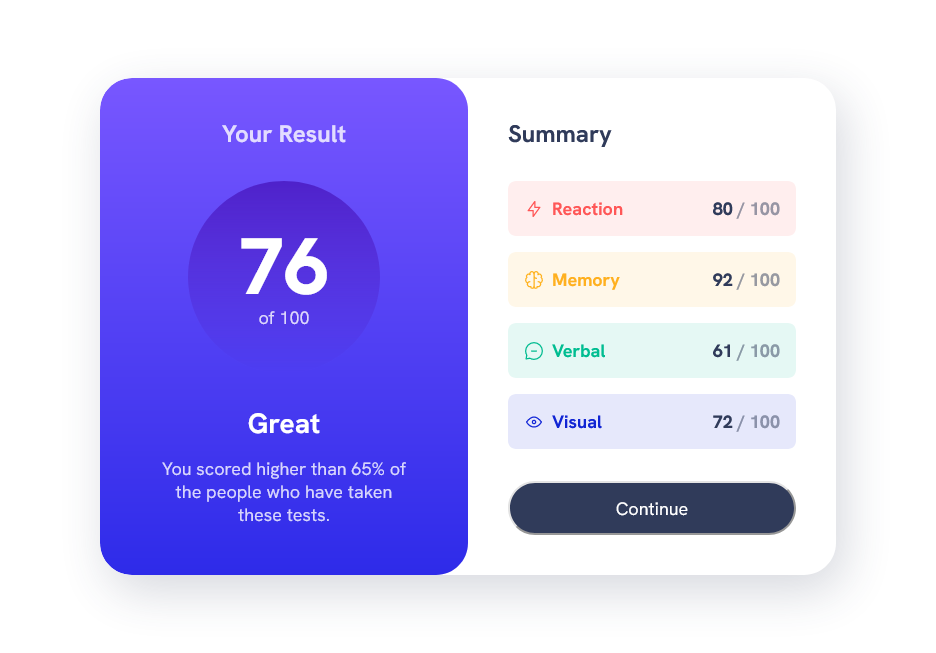

# Frontend Mentor - Results summary component solution

This is a solution to the [Results summary component challenge on Frontend Mentor](https://www.frontendmentor.io/challenges/results-summary-component-CE_K6s0maV). Frontend Mentor challenges help you improve your coding skills by building realistic projects.

## Table of contents

- [Overview](#overview)
  - [The challenge](#the-challenge)
  - [Screenshot](#screenshot)
  - [Links](#links)
- [My process](#my-process)
  - [Built with](#built-with)
  - [What I learned](#what-i-learned)
  - [Continued development](#continued-development)
  - [Useful resources](#useful-resources)
- [Author](#author)
- [Acknowledgments](#acknowledgments)

## Overview

### The challenge

Users should be able to:

- View the optimal layout for the interface depending on their device's screen size
- See hover and focus states for all interactive elements on the page
- **Bonus**: Use the local JSON data to dynamically populate the content

### Screenshot



### Links

- Solution URL: [Github Repository](https://github.com/HectorKayman/result-summary-component)
- Live Site URL: [Github Live Pages](https://hectorkayman.github.io/result-summary-component/)

## My process

### Built with

- HTML5
- CSS custom properties
- Flexbox
- CSS Grid
- Mobile-first workflow

### What I learned

For this challenge, I followed Kevin Powells tutorial, where he shows how he approaches a project from start to finish, he explains the 'how?' and 'why' of things in great details. His tutorial is perfect for this, as I wanted to know the thought process of an experienced frontend developer.

The CSS code showcases a comprehensive set of variables for defining colors, fonts, and other design elements, ensuring consistency and ease of maintenance.

In short, this project and Kevin's tutorial on it, taught me the importance of organized and scalable code, correct responsive design principles, and semantic HTML for creating functional and visually appealing web components.

I also learned the use of custom data properties to modify CSS, as shown below:

```css
.grid-flow[data-spacing="large"] {
  gap: 2rem;
}
```

### Continued development

I will be looking into completing the bonus challenge, in the near future, i.e., using the local JSON data to dynamically populate the content.

And, I will be trying to use the all the things I learned, such as, different versions of global variables, locally scoped variables, custom data propeties, etc. in my future projects

### Useful resources

- [From Design to Code // HTML & CSS from scratch // Frontend Mentor](https://www.youtube.com/watch?v=KqFAs5d3Yl8) - I followed this tutorial by [Kevin Powell](https://www.youtube.com/@KevinPowell) from start to finish.

## Author

- Frontend Mentor - [@HectorKayman](https://www.frontendmentor.io/profile/HectorKayman)

## Acknowledgments

Again, can't thank Kevin Powell enough for an explaination and walkthrough of his entire developement process.
